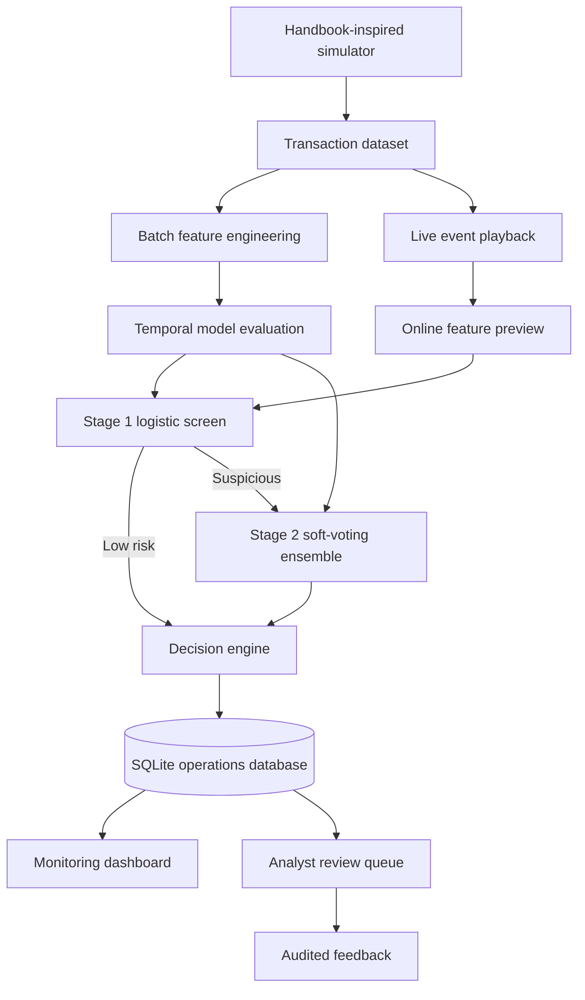

# Architecture

## Data flow

1. The simulator creates customer and terminal profiles, legitimate events, and five temporal fraud scenarios.
2. Batch feature engineering calculates each behavioural feature using only prior events.
3. A chronological split reserves the latest 25% of events for testing.
4. Candidate models are evaluated and the Stage 1 and Stage 2 artifacts are persisted with experiment metadata.
5. The dashboard selects an ordered event sample and submits one event per responsive UI rerun.
6. The online feature store previews the event without mutating historical state.
7. The ingestion boundary normalises identifiers and timestamps and rejects malformed,
   non-finite, or out-of-range feature values.
8. Stage 1 scores every event; only suspicious events invoke the stronger Stage 2 ensemble.
9. Model artifacts are reloaded when they change and must match the configured feature schema.
10. The validated decision engine routes the score to approve, manual review, or block.
11. The event is inserted into SQLite. Only after successful persistence is the online feature state committed.
12. Review status transitions and notes are validated and appended to an audit history.

## Reliability boundaries

- The prototype assumes a single in-process event worker and chronological event time.
- Customer and terminal events older than committed state are rejected.
- SQLite uses WAL mode and a busy timeout, but it is not a substitute for a multi-node production database.
- Generated model artifacts are local and intentionally excluded from Git.
- Analyst identity and role-based access are outside the prototype scope.
