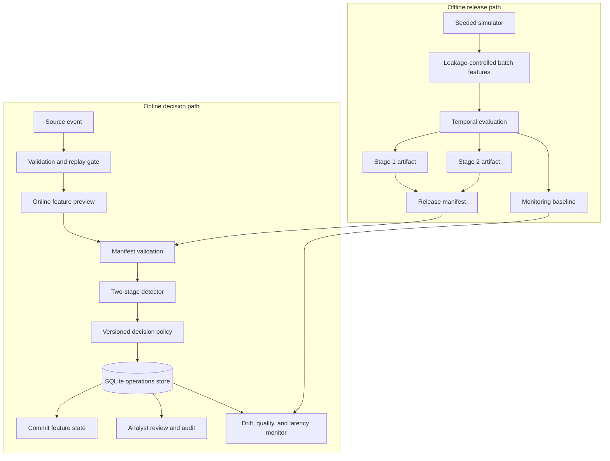

# Architecture

## Runtime and release topology

## Offline release path

1. The seeded simulator creates customer and terminal profiles plus five time-dependent fraud scenarios.
2. Batch features are calculated chronologically; the current event never contributes to its own behavioural history.
3. The latest 25% of events form the holdout, preserving time order.
4. Candidate estimators and the complete two-stage route are evaluated using ranking, classification, latency, and Stage 2 call-rate metrics.
5. Model files are written atomically.
6. A release manifest binds each artifact checksum and size to the ordered feature schema, decision thresholds, and policy version. A deterministic content-derived release ID identifies that bundle.
7. A reference distribution is exported for amount, model score, and decision-action monitoring.

## Online decision transaction

1. The ingestion boundary normalises identifiers and timestamps and rejects malformed, non-finite, out-of-range, or out-of-order data.
2. The source `transaction_id` is checked before feature preview; an already-persisted ID is treated as a replay.
3. The feature store computes a preview without mutating history.
4. Before first use or reload, the detector verifies both model hashes, artifact sizes, feature-schema digest, thresholds, policy version, and release ID.
5. Stage 1 scores every event. Only suspicious events invoke the stronger Stage 2 ensemble.
6. The decision policy validates the score and returns `APPROVE`, `REVIEW`, or `BLOCK` with stable reason codes.
7. SQLite persists the event and its model/policy provenance. A unique database constraint provides a second idempotency boundary for concurrent retries.
8. Only successful persistence commits the feature-state update. Any earlier failure leaves later velocity features unchanged.
9. Review cases follow an explicit state machine, and every transition is appended to the audit log.

## Monitoring loop

The monitoring view compares recent operations with the training reference using Population Stability Index (PSI). It evaluates `tx_amount`, `risk_score`, and the action distribution; also reports malformed-data rate, p95 inference latency, and whether a window mixes model releases or policies.

PSI thresholds are intentionally explicit:

- below `0.10`: healthy
- `0.10` to below `0.25`: warning
- `0.25` or higher: critical

A window below the minimum sample size is labelled `insufficient_data`, not healthy. These are operational heuristics, not statistical proof of model degradation; alerts should trigger investigation and labelled-performance analysis.

## Reliability boundaries

- SQLite runs with WAL, foreign keys, indexes, and a busy timeout, but the application assumes a single ordered worker.
- The replay pre-check improves error clarity; the unique index remains the authoritative concurrency control.
- Local file replacement is atomic on one filesystem. A distributed release process would require an object store and registry transaction.
- Hashes detect corruption and mismatched releases; they are not signatures and do not establish publisher identity.
- The monitoring baseline detects distribution change, not causal failure or fairness regressions.
- Generated datasets, models, reports, and databases are runtime artifacts and are intentionally excluded from Git.

## Key decisions

- [ADR 0001: Content-addressed model release manifests](docs/decisions/0001-model-release-manifests.md)
- [ADR 0002: Idempotent event processing](docs/decisions/0002-idempotent-event-processing.md)
