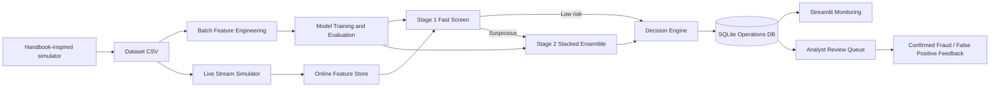

# Architecture



## Data flow

1. The simulator creates customers, terminals, legitimate transactions, and fraud scenarios.
2. Batch feature engineering creates leakage-controlled historical features.
3. The training script evaluates multiple models and saves the best two-stage architecture.
4. The Streamlit app simulates transactions arriving over time.
5. The online feature store computes current behavioural features.
6. Stage 1 quickly approves low-risk transactions.
7. Stage 2 analyses suspicious transactions with a stronger ensemble.
8. The decision engine routes transactions to approve, manual review, or block.
9. The analyst queue records review outcomes and notes.
10. Monitoring views show routing efficiency, latency, actions, review outcomes, and model evaluation.
```
