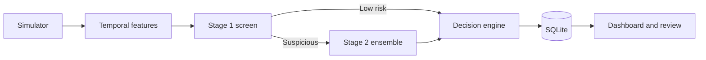

# Fraud Operations Platform

[](https://github.com/mzatylny/fraud_ops/actions/workflows/ci.yml)

An end-to-end bachelor's project prototype for temporal card-fraud detection and analyst operations. The project goes beyond a notebook: it simulates a transaction stream, builds leakage-controlled behavioural features, trains a two-stage detector, persists decisions, and exposes an analyst workflow in Streamlit.

## Highlights

- Reproducible, handbook-inspired customer, terminal, and transaction simulation
- Five time-dependent fraud scenarios with a configurable class-imbalance ceiling
- Matching batch and online feature pipelines to reduce training-serving skew
- Strict stream-event validation before features, scoring, or persistence
- Temporal train/test split rather than a random split
- Fast Stage 1 logistic screen and a Stage 2 probability-averaging ensemble
- Automatic model-artifact reload with feature-schema compatibility checks
- Validated `APPROVE`, `REVIEW`, and `BLOCK` decision routing
- SQLite persistence with WAL mode, indexes, foreign keys, and audit history
- Responsive Streamlit event playback and analyst case management
- Precision, recall, F1, ROC-AUC, PR-AUC, top-1% precision, latency, and routing metrics
- Automated tests and GitHub Actions CI on Python 3.11 and 3.12

## Architecture



See [ARCHITECTURE.md](ARCHITECTURE.md) for the detailed data flow.

## Quick start

Python 3.11 or 3.12 is recommended.

```bash
python -m venv .venv
source .venv/bin/activate        # macOS/Linux
# .venv\Scripts\activate         # Windows PowerShell
python -m pip install --upgrade pip
pip install -r requirements.txt

python train_models.py --customers 900 --terminals 1800 --days 55
streamlit run app.py
```

For a quicker local demonstration:

```bash
python train_models.py --customers 300 --terminals 600 --days 25 --max-transactions 25000
streamlit run app.py
```

The training command creates ignored runtime artifacts under `data/`, `models/`, and `reports/`.

## Tests

```bash
pip install -r requirements-dev.txt
ruff check .
python -m pytest
```

The test suite covers feature-state behaviour, batch/online feature parity, invalid and
out-of-order events, decision boundaries, database audit transitions, simulator
configuration, model artifact reloads, model wrapper validation, and failure-safe
pipeline state. GitHub Actions runs linting and the full suite on Python 3.11 and 3.12.

## Project structure

```text
app.py                       Streamlit operations dashboard
train_models.py              Simulation, temporal evaluation, and artifact export
src/config.py                Paths, feature schema, and risk thresholds
src/dataset_generator.py     Synthetic customers, terminals, and fraud scenarios
src/features.py              Leakage-controlled batch and online features
src/model_wrappers.py        Validated probability-averaging ensemble
src/detector.py              Two-stage scoring and human-readable reasons
src/decision_engine.py       Approve/review/block policy
src/database.py              SQLite persistence and audit trail
src/stream_processor.py      Validated end-to-end event pipeline
tests/                       Automated test suite
```

## Reproducibility and safety

- Simulation and model estimators use fixed random seeds.
- Batch features use only information available before the current event.
- The online store previews features and commits state only after successful scoring and persistence.
- Boolean, non-finite, out-of-range, and malformed stream values are rejected at ingestion.
- Out-of-order customer or terminal events are rejected instead of silently corrupting velocity features.
- Missing or invalid model artifacts produce an actionable error.
- Updated model artifacts are reloaded automatically and checked against the live feature schema.
- Invalid scores and analyst status transitions are rejected.
- Experiment metadata records the feature schema, thresholds, date range, package versions, and artifact version.

## Academic scope and limitations

The simulator is conceptually inspired by the *Reproducible Machine Learning for Credit Card Fraud Detection — Practical Handbook*, but this repository contains a project-specific implementation and additional operational fields and workflows.

The data is synthetic, the live stream is an in-process simulation, and the explanations are rule-based summaries rather than causal model explanations. Results therefore demonstrate system design and experimental methodology; they do not establish production readiness. A production extension should add authenticated APIs, a durable message queue, a managed feature store, model registry and drift monitoring, role-based analyst access, encryption, and evaluation on legally available real data.

## Suggested report title

**Design and Evaluation of a Real-Time Two-Stage Fraud Operations Platform Using Handbook-Inspired Synthetic Transaction Streams**
