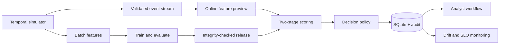

# Fraud Operations Platform

[](https://github.com/mzatylny/fraud_ops/actions/workflows/ci.yml)


A production-minded fraud detection and analyst-operations portfolio project. It simulates a temporal card-payment stream, maintains leakage-controlled behavioural features, runs a two-stage detector, records traceable decisions, measures operational drift, and supports an audited investigation workflow.

The point is not only to train a classifier. The repository demonstrates how to make an ML decision system reproducible, observable, failure-aware, and reviewable.

## Engineering evidence

| Concern | Implementation |
| --- | --- |
| Training/serving consistency | Matching batch and stateful online feature pipelines with parity tests |
| Leakage control | Chronological feature construction and temporal train/test split |
| Model governance | Release manifest with SHA-256 artifact checks, feature-schema digest, thresholds, and policy version |
| Safe deployment | Atomic artifact writes and fail-closed validation before model activation |
| Event reliability | Strict boundary validation, replay rejection, and state commit only after durable persistence |
| Decision traceability | Every stored decision records model release, policy version, score, reason, and audit history |
| Observability | Data/prediction PSI, data-quality rate, p95 scoring latency, release/policy consistency alerts |
| Delivery | Automated unit, integration, and dashboard interaction tests; coverage gate; linting; security scans; dependency audit; container build verification |
| Runtime hardening | Non-root container, read-only root filesystem, health check, and persistent SQLite volume |

## System design



See [ARCHITECTURE.md](ARCHITECTURE.md) for component boundaries and failure behaviour.

## Product capabilities

- Reproducible customer, terminal, and transaction simulation with five temporal fraud scenarios
- Fast Stage 1 logistic screening with selective Stage 2 ensemble invocation
- `APPROVE`, `REVIEW`, and `BLOCK` routing through a versioned policy
- Responsive Streamlit playback, case review, monitoring, evaluation, and data-exploration views
- SQLite WAL persistence with indexes, foreign keys, guarded status transitions, and audit events
- Precision, recall, F1, ROC-AUC, PR-AUC, top-1% precision, latency, and routing evaluation
- Population Stability Index monitoring for transaction amounts, scores, and decision mix
- Idempotent handling of upstream transaction IDs so retries cannot produce duplicate decisions

## Quick start

Python 3.11 or 3.12 is recommended.

```bash
python -m venv .venv
source .venv/bin/activate
python -m pip install --upgrade pip
pip install -r requirements.txt

python train_models.py --customers 300 --terminals 600 --days 25 --max-transactions 25000
streamlit run app.py
```

Open <http://localhost:8501>. The training command writes ignored runtime artifacts under `data/`, `models/`, and `reports/`, including the model release manifest and monitoring baseline required by the application.

For the larger experiment used in a report:

```bash
python train_models.py --customers 900 --terminals 1800 --days 55
```

## Container run

```bash
docker compose up --build
```

The container generates a deterministic demonstration release during the image build, runs as an unprivileged user, exposes a health check, and keeps the application filesystem read-only except for the persisted operations database.

## Quality gates

```bash
pip install -r requirements-dev.txt
make quality
```

The same controls run in GitHub Actions on Python 3.11 and 3.12:

- Ruff linting
- Unit, integration, parity, governance, monitoring, and dashboard interaction tests
- Branch-aware coverage of both `src/` and the Streamlit entry point with a 72% minimum
- Bandit static security analysis
- `pip-audit` dependency vulnerability scanning
- Reproducible container build verification
- CodeQL analysis on pushes, pull requests, and a weekly schedule

Dependabot checks Python and GitHub Actions dependencies weekly. Updates remain review-only;
the repository does not auto-merge them.

## Repository map

```text
app.py                         Streamlit operations dashboard
train_models.py                Simulation, temporal evaluation, and release export
src/config.py                  Paths, feature schema, thresholds, and policy version
src/dataset_generator.py       Synthetic entities, events, and fraud scenarios
src/features.py                Leakage-controlled batch and online features
src/model_wrappers.py          Validated probability-averaging ensemble
src/model_registry.py          Atomic release manifests and integrity validation
src/detector.py                Governed two-stage inference and explanations
src/decision_engine.py         Approve/review/block policy
src/database.py                Idempotent persistence and review audit trail
src/monitoring.py              PSI, latency, quality, and provenance monitoring
src/stream_processor.py        Validated end-to-end event transaction
docs/                          Operations, governance, threat model, and ADRs
tests/                         Automated verification suite
```

## Reproducibility and safety properties

- Fixed seeds control simulation and estimator randomness.
- Each behavioural feature uses only observations preceding the current transaction.
- Online state is previewed first and committed only after scoring and persistence succeed.
- Malformed, non-finite, out-of-range, out-of-order, and replayed events are rejected.
- Model files activate only when their bytes, feature schema, thresholds, policy, and release ID match the manifest.
- Every decision is attributable to the exact model release and decision policy that produced it.
- Monitoring distinguishes insufficient samples from healthy traffic and alerts on drift, bad data, latency, and mixed releases.

## Scope and limitations

This is an engineering portfolio system, not a production payment processor. Its data is synthetic, explanations are deterministic reason summaries rather than causal explanations, the stream runs in one process, and SQLite is not a multi-node event store. Authentication, authorization, encryption/key management, fairness analysis, champion/challenger deployment, retraining approval, and evaluation on legally available real data remain production responsibilities.

The simulator is conceptually inspired by the *Reproducible Machine Learning for Credit Card Fraud Detection — Practical Handbook*, while its implementation, operational fields, governance controls, and workflow are project-specific.

Further details:

- [Model governance](docs/MODEL_GOVERNANCE.md)
- [Operations runbook](docs/OPERATIONS.md)
- [Threat model](docs/THREAT_MODEL.md)
- [Release history](CHANGELOG.md)

## Suggested report title

**Design and Evaluation of a Governed Two-Stage Fraud Operations Platform Using Temporal Synthetic Transaction Streams**
